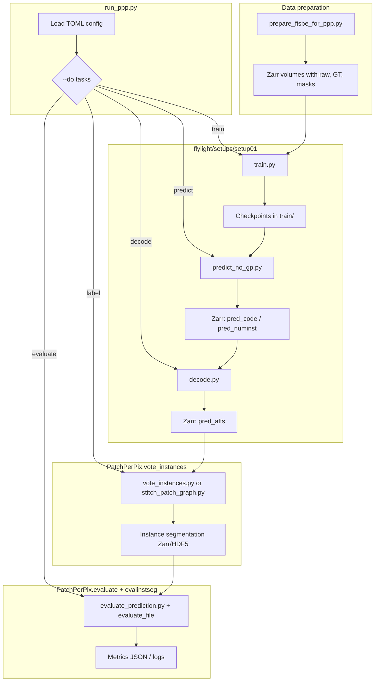

# PatchPerPix Codebase Guide

This document explains how the **PatchPerPix** repository is organized, how its files connect, and what each script does. PatchPerPix is a proposal-free instance segmentation method: a neural network predicts dense local shape descriptors (patch affinities) per voxel, and a separate **vote-instances** pipeline assembles those predictions into final instance labels.

The repository has two top-level areas:

| Path | Role |
|------|------|
| `PatchPerPix/` (Python package) | Instance assembly, evaluation, visualization, shared utilities |
| `experiments/` | Experiment orchestration (`run_ppp.py`) and dataset-specific training/inference code |

Configuration is driven by **TOML files** (e.g. `experiments/flylight/setups/setup01/default_train_code_l40s.toml`). The main entry point never hard-codes hyperparameters; it loads config and dynamically imports setup scripts.

---

## End-to-end pipeline



**Typical FlyLight workflow (`ppp+dec` mode):**

1. **Prepare data** — normalize raw images and derive training keys in zarr.
2. **Train** — U-Net predicts patch **codes** + **numinst** (overlapping-instance count) per voxel.
3. **Predict** — sliding-window inference writes `pred_code` and `pred_numinst` to zarr.
4. **Decode** — autoencoder decoder expands compact codes into full patch affinity vectors (`pred_affs`).
5. **Label** — vote-instances builds a patch graph and converts it to instance IDs.
6. **Evaluate** — compare predictions/instances to ground truth.

---

## How files connect

### 1. Package installation (`setup.py`)

`setup.py` registers the installable package and dependencies (PyTorch ecosystem, gunpowder, zarr, pycuda, `evalinstseg`, etc.). After `pip install -e .`, imports like `from PatchPerPix import vote_instances` work from `experiments/run_ppp.py`.

### 2. Orchestrator → setup modules (`run_ppp.py`)

`run_ppp.py` is the hub. It:

- Parses CLI (`--app`, `--setup`, `--config`, `--do`, `--root`, `--exp-id`).
- Merges TOML config sections: `general`, `data`, `model`, `training`, `optimizer`, `prediction`, `vote_instances`, `evaluation`, `validation`, `postprocessing`.
- Creates experiment folders: `{base}/train`, `{base}/val`, `{base}/test`.
- **Dynamically imports** setup scripts by naming convention:

```python
importlib.import_module(f"{args.app}.setups.{args.setup}.train").train_until
importlib.import_module(f"{args.app}.setups.{args.setup}.predict_no_gp").predict
importlib.import_module(f"{args.app}.setups.{args.setup}.decode").decode
```

For the `flylight` app, these resolve to `experiments/flylight/setups/setup01/*.py` (Python path includes `experiments/` when run from that directory).

### 3. Training stack (`train.py` → `torch_model.py` + `torch_loss.py`)

| Component | Connection |
|-----------|------------|
| `train.py` | Builds **gunpowder** data pipelines; calls `torch_model.UnetModelWrapper` and `torch_loss.LossWrapper` |
| `torch_model.py` | U-Net from `funlib.learn.torch`; optional code head + decoder (`Autoencoder`); affinity generation via `PatchPerPix.util.train_util` |
| `torch_loss.py` | Masked CE/BCE losses for affinities, codes, numinst |
| `PatchPerPix.util.train_util` | `normalize`, checkpoint helpers, `seg_to_affgraph_*` for on-the-fly GT affinities |

### 4. Inference stack (`predict_no_gp.py` → `decode.py`)

| Step | Input | Output |
|------|-------|--------|
| `predict_no_gp.predict` | Raw zarr + checkpoint | `pred_code`, `pred_numinst` (or `pred_affs` / `pred_fgbg` without code mode) |
| `decode.decode` | `pred_code` + foreground mask from numinst | `pred_affs` zarr array |

Both reuse `UnetModelWrapper` from `torch_model.py`.

### 5. Instance assembly (`run_ppp.py` → `vote_instances`)

`run_ppp.py:vote_instances_sample` delegates to either:

- **`PatchPerPix.vote_instances.vote_instances.main`** — whole-volume CUDA/CPU assembly, or
- **`PatchPerPix.vote_instances.stitch_patch_graph.main`** — blockwise processing for large volumes.

Internal vote-instances dependency chain:

```
vote_instances.py (to_instance_seg)
  ├── utilVoteInstances.py      (load affinities, foreground, numinst)
  ├── consensus_array.py        (patch agreement voting)
  ├── ranked_patches.py         (rank patches by score)
  ├── aff_patch_graph.py        (build NetworkX graph from patch pairs)
  ├── foreground_cover.py       (select patches to cover foreground)
  ├── get_patch_sets.py         (fg/bg/boundary patch sets)
  ├── graph_to_labeling.py      (graph → instance IDs)
  ├── graph_mws.py              (optional Mutex Watershed)
  ├── cuda_code.py              (PyCUDA kernels)
  └── io_hdflike.py             (Zarr/HDF5/N5 I/O abstraction)
```

### 6. Evaluation & visualization

| Caller | Callee |
|--------|--------|
| `run_ppp.py:evaluate` | `evalinstseg.evaluate_file` for instance metrics |
| `run_ppp.py:evaluate_prediction` | `PatchPerPix.evaluate.evaluate_patch`, `evaluate_numinst`, `evaluate_fg` |
| `run_ppp.py:visualize` | `PatchPerPix.visualize.patches`, `instances` |
| `run_ppp.py:postprocess` | `PatchPerPix.util.postprocess` |

---

## Directory layout

```
PatchPerPix/
├── setup.py                          # pip package definition
├── README.md                         # upstream project README
├── CODEBASE.md                       # this file
├── PatchPerPix/                      # core library
│   ├── vote_instances/               # instance assembly (CUDA + CPU)
│   ├── evaluate/                     # intermediate prediction metrics
│   ├── visualize/                    # patch & instance rendering
│   └── util/                         # training helpers, GPU pick, postprocess
└── experiments/
    ├── run_ppp.py                    # main CLI orchestrator
    └── flylight/
        ├── prepare_fisbe_for_ppp.py    # FISBe zarr preprocessing
        └── setups/setup01/
            ├── default*.toml           # example configs
            ├── train.py
            ├── predict_no_gp.py
            ├── decode.py
            ├── torch_model.py
            └── torch_loss.py
```

---

## Script reference

### `experiments/run_ppp.py`

**Purpose:** Single entry point for the full experiment lifecycle — training, validation sweeps, prediction, decoding, labeling, postprocessing, evaluation, and cleanup.

**Major functions:**

| Function | Purpose |
|----------|---------|
| `get_arguments()` | CLI parser (`--do`, `--app`, `--setup`, `--config`, checkpoints, etc.) |
| `main()` | Loads config, selects GPU, dispatches all requested `--do` tasks in order |
| `create_folders()` | Creates `train/`, `val/`, `test/` under experiment root |
| `update_config()` | Overrides config from CLI flags |
| `train()` | Resolves `train_until` from setup module; passes data paths and hyperparameters |
| `get_list_train_files()` / `get_list_samples()` | Enumerate zarr training/test samples from config |
| `predict()` / `predict_no_gp()` / `predict_sample()` | Fan out inference workers per sample |
| `decode()` | Calls setup `decode()` when `train_code` is enabled |
| `validate_checkpoints()` | Grid search over checkpoints + vote-instances hyperparameters |
| `vote_instances()` / `vote_instances_sample()` | Per-sample instance assembly via `PatchPerPix.vote_instances` |
| `evaluate()` / `evaluate_prediction()` / `evaluate_sample()` | Final and intermediate metrics |
| `visualize()` | Optional patch/instance PNG/HDF outputs |
| `postprocess` path in `main()` | Small-component removal, relabeling via `util.postprocess_*` |
| `cleanup()` | Delete prediction zarrs after successful labeling |
| `fork()` / `fork_return()` | Multiprocessing wrappers for isolated CUDA subprocesses |

---

### `experiments/flylight/setups/setup01/train.py`

**Purpose:** Gunpowder-based training loop for the FlyLight setup. Samples random patches from zarr volumes, augments data, runs forward/backward through the U-Net, and saves checkpoints.

**Major functions:**

| Function | Purpose |
|----------|---------|
| `train_until(**config)` | Main training entry called by `run_ppp.py`; resumes from latest checkpoint; builds gunpowder pipeline, optimizer, validation hooks |
| `get_sources(config, arrays, ...)` | Configures zarr/HDF data sources and augmentation providers for train/val |

**Key dependencies:** `torch_model.UnetModelWrapper`, `torch_loss.LossWrapper`, `gunpowder`, `neurolight.gunpowder`, `PatchPerPix.util.normalize`, `get_latest_checkpoint`.

---

### `experiments/flylight/setups/setup01/torch_model.py`

**Purpose:** Neural network architecture — shared U-Net encoder with multiple heads for patch codes/affinities and foreground/numinst prediction; includes decoder for `ppp+dec`.

**Major classes / methods:**

| Symbol | Purpose |
|--------|---------|
| `UnetModelWrapper` | Wraps `funlib.learn.torch.models.UNet` (or MONAI SwinUNETR); supports `single`, `split`, `multihead` styles |
| `UnetModelWrapper.inout_shapes()` | Computes valid/same-padding input/output sizes for train vs test |
| `UnetModelWrapper.forward()` | Runs U-Net; generates affinities from codes or direct heads |
| `UnetModelWrapper.decoder` | Autoencoder branch used in `decode.py` |
| `Autoencoder` | Standalone conv autoencoder for patch decoding |

**Key dependencies:** `PatchPerPix.util.train_util` (`seg_to_affgraph_*`, `gather_nd_torch`, `crop`).

---

### `experiments/flylight/setups/setup01/torch_loss.py`

**Purpose:** Loss functions with spatial masking (for partly-labeled regions) and combined multi-task weighting.

**Major classes:**

| Class | Purpose |
|-------|---------|
| `MaskedCrossEntropyLoss` | CE loss masked by foreground / loss mask |
| `MaskedBCEWithLogitsLoss` | BCE for binary fg/bg head |
| `LossWrapper` | Aggregates affinity, code, numinst, and fg losses with TensorBoard logging |

---

### `experiments/flylight/setups/setup01/predict_no_gp.py`

**Purpose:** Blockwise sliding-window inference without gunpowder in the worker (despite importing gp for coordinates). Writes predictions into zarr.

**Major functions:**

| Function | Purpose |
|----------|---------|
| `predict(**config)` | Loads checkpoint, iterates shifts over volume, accumulates overlapping predictions |
| `create_zarr_outputs()` | Creates output zarr arrays (`pred_code`, `pred_numinst`, etc.) |
| `enumerate_shifts()` | Yields block origins for tiled inference |

---

### `experiments/flylight/setups/setup01/decode.py`

**Purpose:** Expands compact per-voxel **codes** into full patch affinity tensors using the trained decoder (ppp+dec mode).

**Major functions:**

| Function | Purpose |
|----------|---------|
| `decode(**config)` | Loads model checkpoint; iterates samples; writes `pred_affs` into zarr |
| `decode_sample()` | Batched decoder forward pass on foreground voxels only |
| `_fg_mask_from_numinst_zarr()` | Derives foreground mask from `pred_numinst` slice-by-slice (memory efficient) |

---

### `experiments/flylight/prepare_fisbe_for_ppp.py`

**Purpose:** One-time preprocessing for FISBe zarr datasets — adds arrays expected by the training config (`raw_normalized`, `gt_instances_rm_5`, `gt_numinst`, `gt_fg_rm_5`).

**Major functions:**

| Function | Purpose |
|----------|---------|
| `prepare_sample()` | Normalize raw, compute numinst, morphological opening on fg mask |
| `prepare_folder()` | Batch over a directory of `.zarr` stores |
| `main()` | CLI entry |

---

### `PatchPerPix/vote_instances/vote_instances.py`

**Purpose:** Core instance assembly algorithm — from predicted affinities + foreground to instance segmentation.

**Major functions:**

| Function | Purpose |
|----------|---------|
| `to_instance_seg()` | Full pipeline: consensus → ranking → patch graph → labeling |
| `do_block()` / `do_all()` | Blockwise vs whole-volume execution paths |
| `main(**kwargs)` | CLI/API entry; loads data, calls `to_instance_seg`, writes result zarr/HDF5 |
| `get_arguments()` | Standalone CLI for vote-instances (also used when run directly) |

---

### `PatchPerPix/vote_instances/stitch_patch_graph.py`

**Purpose:** Blockwise variant for large volumes — processes chunks and stitches patch graphs across block boundaries.

**Major functions:**

| Function | Purpose |
|----------|---------|
| `blockwise_vote_instances()` | Iterate zarr chunks with overlap/context |
| `stitch_vote_instances()` | Merge partial graphs from adjacent blocks |
| `load_input()` / `write_output()` | Chunked I/O via `io_hdflike` |
| `get_offsets()` / `get_chessboard_offsets()` | Block scheduling |
| `main()` | Entry called from `run_ppp.py` when `blockwise=true` |

---

### `PatchPerPix/vote_instances/aff_patch_graph.py`

**Purpose:** Build a patch affinity graph — edges connect nearby patch centers; edge weights come from predicted affinities.

**Major functions:**

| Function | Purpose |
|----------|---------|
| `computeAndStorePatchPairs()` | KD-tree query for spatially neighboring patches |
| `computePatchGraph()` / `computePatchGraph_cuda()` | Fill edge affinities from predictions |
| `loadAffgraph()` / `setAffgraph()` | Load/save NetworkX graph from numpy intermediates |

---

### `PatchPerPix/vote_instances/consensus_array.py`

**Purpose:** Vote which patch hypothesis (fg vs bg) is most consistent at each voxel.

**Major functions:**

| Function | Purpose |
|----------|---------|
| `create_consensus_array()` | CPU consensus voting |
| `create_consensus_array_cuda()` | GPU-accelerated variant |
| `loadOrComputeConsensus()` | Cache or recompute consensus volume |

---

### `PatchPerPix/vote_instances/ranked_patches.py`

**Purpose:** Rank patch candidates by agreement scores for greedy selection.

**Major functions:**

| Function | Purpose |
|----------|---------|
| `rank_patches()` | CPU ranking |
| `rank_patches_cuda()` | GPU ranking |
| `loadOrComputePatchRanking()` | Cached ranking loader |

---

### `PatchPerPix/vote_instances/foreground_cover.py`

**Purpose:** Greedy patch selection to cover foreground voxels.

**Major functions:**

| Function | Purpose |
|----------|---------|
| `computeForegroundCover()` | Main cover algorithm |
| `computeForegroundCoverLoop()` | Iterative cover loop |
| `thinOutForegroundCover()` | Prune redundant patches |

---

### `PatchPerPix/vote_instances/get_patch_sets.py`

**Purpose:** Classify patches into foreground, background, and boundary sets for graph construction.

**Major functions:** `get_foreground_set()`, `get_background_set()`, `get_boundary_set()`.

---

### `PatchPerPix/vote_instances/graph_to_labeling.py`

**Purpose:** Convert the final affinity graph into a voxel-wise instance label image.

**Major functions:** `affGraphToInstances()`, `affGraphToInstancesT()` (transposed layout).

---

### `PatchPerPix/vote_instances/utilVoteInstances.py`

**Purpose:** Shared I/O and geometry helpers for the vote-instances pipeline.

**Major functions:**

| Function | Purpose |
|----------|---------|
| `loadAffinities()` | Read affinity zarr/HDF5 with resolution/offset metadata |
| `loadFg()` / `maybeLoadNuminst()` / `returnFg()` | Foreground derivation |
| `fillLookup()` | Patch index lookup tables |
| `computeFGBGsets()` | Foreground/background patch classification |
| `loadKernelFromFile()` / `setKernelBuildOptions()` | CUDA kernel setup |
| `get_block_shape()` / `get_grid_shape()` | Tiling geometry |

---

### `PatchPerPix/vote_instances/io_hdflike.py`

**Purpose:** Unified reader/writer for zarr, HDF5, and N5 backends.

**Major classes:** `IoBase`, `IoZarr`, `IoHDF5`, `IoN5`, `IoDVID`.

---

### `PatchPerPix/vote_instances/cuda_code.py`

**Purpose:** PyCUDA initialization and kernel compilation helpers.

**Major functions:** `init_cuda()`, `make_kernel()`, `alloc_zero_array()`, `sync()`, `get_cuda_stream()`.

---

### `PatchPerPix/vote_instances/offsets.py`

**Purpose:** Precompute block offset lists for tiled processing.

**Major functions:** `get_offset_lists()`, `get_offset_lists_with_bb()`, `offset_list_from_precomputed()`.

---

### `PatchPerPix/vote_instances/graph_mws.py`

**Purpose:** Optional Mutex Watershed partition of the affinity graph.

**Major function:** `mws(affgraph)`.

---

### `PatchPerPix/vote_instances/isbi_hacks.py`

**Purpose:** Dataset-specific workarounds (ISBI 2012 EM).

**Major functions:** `sparsifyPatches()`, `filterInstanceBoundariesFromFG()`.

---

### `PatchPerPix/evaluate/evaluate_prediction.py`

**Purpose:** Evaluate network outputs *before* full instance assembly (patch affinity error, numinst accuracy, fg dice).

**Major functions:**

| Function | Purpose |
|----------|---------|
| `evaluate_patch()` | Compare predicted vs GT affinities on foreground |
| `evaluate_numinst()` | Overlapping-instance count regression metrics |
| `evaluate_fg()` | Foreground segmentation quality |
| `main()` | Standalone CLI |
| `get_affinity_function()` | Pick 2D/3D affinity conversion for GT |

---

### `PatchPerPix/visualize/patches.py`

**Purpose:** Reshape flat affinity channels into patch-shaped volumes for inspection.

**Major functions:** `reshape_affinities()`, `reshape_affinities_3d()`, `visualize_patches()`, `main()`.

---

### `PatchPerPix/visualize/instances.py`

**Purpose:** Colorize instance label images for quick visual QA.

**Major functions:** `visualize_instances()`, `hex_to_rgb()`, `main()`.

---

### `PatchPerPix/util/train_util.py`

**Purpose:** Training and inference helpers shared across setups.

**Major functions:**

| Function | Purpose |
|----------|---------|
| `get_latest_checkpoint()` | Find most recent `*_checkpoint_*` file |
| `normalize()` | Intensity normalization for raw input |
| `crop()` / `crop_to_factor()` | Spatial cropping aligned to network factors |
| `gather_nd_torch()` | Indexed gathering for affinity sampling |
| `seg_to_affgraph_*` (2D/3D, multi/single, code variants) | Convert instance labels to patch affinity targets |

---

### `PatchPerPix/util/postprocess.py`

**Purpose:** Optional cleanup of predictions and instance maps.

**Major functions:** `postprocess_instances()`, `postprocess_fg()`, `remove_small_components()`, `relabel()`, `color()`.

---

### `PatchPerPix/util/selectGPU.py`

**Purpose:** Query `nvidia-smi` and pick free GPU(s) when `CUDA_VISIBLE_DEVICES` is unset.

**Major function:** `selectGPU(quantity=1)`.

---

### `PatchPerPix/util/losses.py`

**Purpose:** Legacy TensorFlow-style loss helpers (mostly superseded by `torch_loss.py` but still referenced in some code paths).

**Major functions:** `get_loss_fn()`, `get_loss()`, `get_loss_weighted()`, `get_loss_print()`.

---

## Configuration sections (TOML)

Understanding the config keys clarifies how scripts receive parameters:

| Section | Consumed by |
|---------|-------------|
| `[data]` | `train.py`, `predict_no_gp.py`, `run_ppp.py` (paths, zarr keys, voxel size) |
| `[model]` | `torch_model.py`, `train.py`, `predict_no_gp.py`, `decode.py`, vote-instances |
| `[training]` | `train.py` (iterations, affinities mode, `train_code`, augmentation) |
| `[optimizer]` | `train.py` (learning rate, SWA, etc.) |
| `[prediction]` | `predict_no_gp.py`, `run_ppp.py` (output keys, `fg_thresh`) |
| `[vote_instances]` | `vote_instances.py`, `stitch_patch_graph.py` (thresholds, CUDA, blockwise) |
| `[validation]` | `run_ppp.py:validate_checkpoints` (checkpoint list, param grid) |
| `[evaluation]` | `run_ppp.py:evaluate` (metric name, GT keys, IoU thresholds) |
| `[postprocessing]` | `util.postprocess_*` |
| `[visualize]` | vote-instances debug outputs |

---

## Typical invocation

From `experiments/`:

```bash
python run_ppp.py \
  --app flylight \
  --setup setup01 \
  --config flylight/setups/setup01/default_train_code_l40s.toml \
  --root ppp_experiments \
  --do train validate_checkpoints predict decode label evaluate
```

Resume an existing run:

```bash
python run_ppp.py \
  --app flylight \
  --setup setup01 \
  --config ppp_experiments/<exp_id>/config.toml \
  --exp-id ppp_experiments/<exp_id> \
  --do predict decode label evaluate
```

---

## Design notes

1. **Separation of concerns:** Learning (PyTorch + gunpowder in `experiments/`) is isolated from assembly (CUDA graph algorithm in `PatchPerPix/vote_instances/`). The only bridge is zarr files on disk.

2. **Dynamic imports:** New datasets can be added by creating `experiments/<app>/setups/<setup>/` with the same `train.py` / `predict_no_gp.py` / `decode.py` interface.

3. **ppp vs ppp+dec:** When `train_code=false`, the network predicts affinities directly and the `decode` step is skipped. When `train_code=true`, the network predicts low-dimensional codes that are expanded by the decoder at inference time (smaller memory footprint during training).

4. **Overlapping instances:** `overlapping_inst=true` switches from binary fg/bg to a **numinst** head (count of instances per voxel), which is required for dense, crossing structures like FlyLight neurons.

5. **Blockwise labeling:** For terabyte-scale volumes, set `vote_instances.blockwise=true` to use `stitch_patch_graph.py` instead of loading the full volume into memory.

---

## External dependencies (not in this repo)

| Package | Used for |
|---------|----------|
| `gunpowder` / `neurolight` | Training data pipelines |
| `funlib.learn.torch` | U-Net implementation |
| `evalinstseg` | Instance segmentation evaluation metrics |
| `zarr` / `h5py` | Volume I/O |
| `pycuda` | Vote-instances CUDA kernels |
