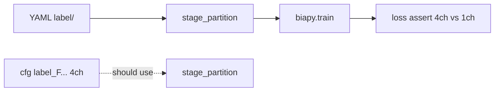

# Fix BiaPy train GT staging (2026-08-05)

Cursor chat writeup: `biapy-v1-no-aug` train crash from staging the wrong label directory, plan, fix in `run_biapy-py.py`, and verification.

## Context

Config [`BiaPy/configs/biapy-v1-no-aug.yaml`](BiaPy/configs/biapy-v1-no-aug.yaml) uses instance segmentation with

```yaml
PROBLEM.INSTANCE_SEG.DATA_CHANNELS: ['F', 'C', 'Db', 'Dn']
```

Train data lives under `fisbe/biapy-no-aug/`. Preprocessing had already produced the derived multi-channel masks. Training is launched via:

```bash
./sbatch/biapy/biapy-py_sbatch_chain.sh biapy-v1-no-aug train
```

which runs `BiaPy/run_biapy-py.py -m train` inside the `BiaPy_env` Singularity overlay.

## Symptom

Job **15395796** failed on the first loss call:

```text
AssertionError: Seems that the GT loaded doesn't have 4 channels as expected
in ['F', 'C', 'Db', 'Dn']. GT shape: torch.Size([105, 1, 20, 128, 128])
```

Log trail:

- BiaPy correctly rewrote `DATA.TRAIN.GT_PATH` to `…/train/label_F.…_Dn.…` (4-channel float32 TIFFs, shape `(Z, 4, Y, X)` on disk).
- Staging still copied from YAML `…/train/label` (raw instance IDs, `(Z, Y, X)`).
- After staging, cfg pointed at the staged 1-channel dir; loaded GT was `(13724, 20, 128, 128)` while the U-Net outputs 4 channels.

On-disk check:

| Dir | Sample shape |
|-----|----------------|
| `train/label` | `(431, 687, 684)` uint16 |
| `train/label_F.…_Dn.…` | `(431, 4, 687, 684)` float32 |
| `train/raw` | `(431, 3, 687, 684)` uint16 |

## Root cause

[`BiaPy/run_biapy-py.py`](BiaPy/run_biapy-py.py) train mode snapshotted YAML `PATH` / `GT_PATH` **before** `BiaPy(...)` init, then staged from those paths even though the comment noted that `prepare_instance_data` may rewrite GT to a multi-channel `label_F…` dir. `update_config` then overwrote `DATA.TRAIN.GT_PATH` with the staged 1-channel copy.



## Plan (as executed)

Edit only the train branch of `BiaPy/run_biapy-py.py`:

1. After `BiaPy(...)` init, stage from `biapy.cfg.DATA.TRAIN.PATH` and `biapy.cfg.DATA.TRAIN.GT_PATH`.
2. Keep YAML `GT_PATH` only for a guard: if `DATA_CHANNELS` has more than one channel and post-init GT still equals the YAML path, raise `RuntimeError` (run preprocessing first).
3. Log the post-init paths actually used for pairing.
4. No config / sbatch / data-prep changes.

## Fix applied

### `BiaPy/run_biapy-py.py` (train branch)

```python
case 'train':
    # YAML GT_PATH is the raw instance-ID dir; BiaPy may rewrite it to a
    # multi-channel label_F... dir during prepare_instance_data.
    with open(config_path) as f:
        yaml_cfg = yaml.safe_load(f)
    yaml_train_gt = yaml_cfg['DATA']['TRAIN']['GT_PATH']

    biapy = BiaPy(
        config=config_path,
        result_dir=RESULT_DIR.as_posix(),
        name=args.job_name,
        run_id=args.run_id,
        gpu='0',
        verbose=True
    )

    # Stage from post-init paths so multi-channel masks are used.
    train_raw = biapy.cfg.DATA.TRAIN.PATH
    train_gt = biapy.cfg.DATA.TRAIN.GT_PATH
    data_channels = list(
        biapy.cfg.PROBLEM.INSTANCE_SEG.DATA_CHANNELS or []
    )
    if (
        len(data_channels) > 1
        and Path(train_gt).resolve() == Path(yaml_train_gt).resolve()
    ):
        raise RuntimeError(
            f'Expected BiaPy to rewrite DATA.TRAIN.GT_PATH to a '
            f'multi-channel label_F... dir for channels '
            f'{data_channels}, but it is still {train_gt!r}. '
            f'Run preprocessing first so the derived GT exists.'
        )

    print(
        f'Staging train pairs from PATH={train_raw} '
        f'GT_PATH={train_gt}'
    )

    pairs = list_train_pairs(train_raw, train_gt)
```

## Verification

Resubmitted:

```bash
./sbatch/biapy/biapy-py_sbatch_chain.sh biapy-v1-no-aug train
# → job 15396661
```

Success signals in `sbatch/biapy/BiaPy-py-biapy-v1-no-aug-train-15396661.out`:

- Staging: `GT_PATH=fisbe/biapy-no-aug/train/label_F.erosion-0.…_Dn.…` (not `…/label`).
- No `gt_channels_expected` / `AssertionError` in `.err`.
- Epoch 1 started with per-channel metrics: IoU (F), IoU (C), L1 (Db), L1 (Dn).
- Training continued (epochs 5+, val loss improving, best checkpoint saved under `metrics/biapy/biapy-v1-no-aug/checkpoints/`).

Note: BiaPy’s “Loaded train GT shape” log line still prints `(N, 20, 128, 128)` without an explicit channel axis; channel count is confirmed by the loss metrics, not that printout.

## Related paths

| Path | Role |
|------|------|
| `BiaPy/run_biapy-py.py` | Train staging + guard |
| `BiaPy/configs/biapy-v1-no-aug.yaml` | Config (`DATA_CHANNELS` F/C/Db/Dn) |
| `fisbe/biapy-no-aug/train/label` | Raw 1-ch instance IDs |
| `fisbe/biapy-no-aug/train/label_F.…` | Derived 4-ch training masks |
| `sbatch/biapy/biapy-py_sbatch_chain.sh` | Submit preprocessing/train/test |
| `sbatch/biapy/BiaPy-py-biapy-v1-no-aug-train-15395796.{out,err}` | Failed run |
| `sbatch/biapy/BiaPy-py-biapy-v1-no-aug-train-15396661.{out,err}` | Fixed run |

## Notes left alone

- Custom watershed `UserWarning` from BiaPy when channels are non-default remains expected; YAML already sets watershed seed/growth fields.
- Slow first-epoch data load with 4-ch float32 GT is expected vs 1-ch labels; not part of this bug.
