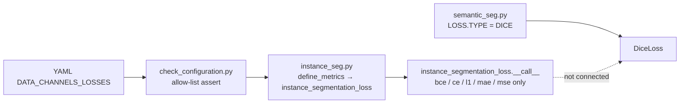
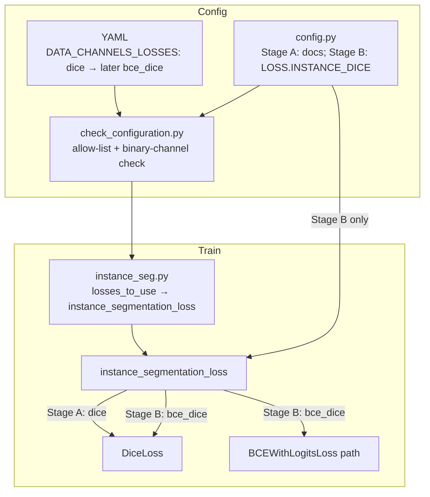

# Instance Segmentation Dice Loss — Staged Plan

Add soft Dice (and optionally BCE+Dice) as a per-channel loss for BiaPy
**instance segmentation**, wired through `PROBLEM.INSTANCE_SEG.DATA_CHANNELS_LOSSES`
in **BiaPy-novabro**.

> **Not available today.** `LOSS.TYPE: DICE` / `W_CE_DICE` only apply to
> **semantic** segmentation (`semantic_seg.py`). Instance seg uses
> `instance_segmentation_loss` + `DATA_CHANNELS_LOSSES`, which currently allow only
> `bce | ce | mse | l1 | mae | embedseg`. `DiceLoss` already exists in
> `biapy/engine/metrics.py` but is unused by the instance path.
>
> **Not Soft Skeleton Recall.** `LOSS.SKELETON_RECALL` is a separate aux term on
> tubed-skeleton GT `Sk` (see `skeleton_recall_loss.md`). Dice supervises the
> predicted binary channel (`F`/`M`) against its own soft/hard FG target.

---

## Goal

Enable YAML like:

```yaml
PROBLEM:
  INSTANCE_SEG:
    DATA_CHANNELS: ['F', 'Db']
    DATA_CHANNELS_LOSSES: ['dice', 'l1']       # Stage A — pure Dice on F
    # or later:
    # DATA_CHANNELS_LOSSES: ['bce_dice', 'l1'] # Stage B — BCE + Dice on F
    DATA_CHANNEL_WEIGHTS: (1.0, 1.0)
```

Keep distance / continuous channels (`Db`, `Dc`, `Dn`, …) on `l1`/`mse` unless
explicitly requested otherwise. Do not invent a loss entry for aux channels
`Sk` / `We` / `I`.

---

## Current wiring (baseline)



| Location | Role today |
|----------|------------|
| `biapy/config/config.py` | Documents `DATA_CHANNELS_LOSSES` options (no `dice`) |
| `biapy/engine/check_configuration.py` | Auto-fills losses; asserts allow-list |
| `biapy/engine/instance_seg.py` | Passes `losses_to_use` into `instance_segmentation_loss` |
| `biapy/engine/metrics.py` | `DiceLoss` class; instance branch has no `"dice"` arm |
| Project YAMLs | FDb / FDcDn (+skel) rely on auto `bce`+`l1` |

---

## Design choices (locked — Stage 0)

| Choice | Decision | Why |
|--------|----------|-----|
| First delivery | **Stage A only** (`dice`); Stage B later | Smallest usable change; validate wiring before hybrid |
| Which channels may use Dice? | Binary-like only: `F`, `B`, `M`, `P`, `C`, `T`, `A`, `F_*` | Soft Dice on continuous `Db`/`Dc` is poorly scaled; keep regression losses |
| Stage B hybrid weights | **`LOSS.INSTANCE_DICE.*`** (`W_DICE`, `W_BCE`) | Clear, parallel to `LOSS.SKELETON_RECALL.*`; do not overload `LOSS.WEIGHTS` |
| Class rebalance / border `We` | Apply to BCE part only for `bce_dice`; Dice is global soft overlap | Matches existing BCE spatial-weight path |
| Activation | Unchanged (`ce_sigmoid` on `F`) | `DiceLoss` applies sigmoid/softmax on logits internally |
| Default auto-fill | Keep `F` → `bce` (do **not** silently switch to Dice) | Avoid changing existing runs; opt-in via YAML |
| Overlay | After code change, reinstall editable package into `env/BiaPy_env.ext3` | Jobs import installed `biapy`, not raw checkout unless `PYTHONPATH` |

**Implementation order:** Stage A → (optional C/D for A) → Stage B → rest. Do not start Stage B until Stage A works.

---

## Stage map

```text
Stage 0  Spec + decisions             (LOCKED / Done)
Stage A  Pure `dice` on binary heads  (Done)
Stage B  `bce_dice` + LOSS.INSTANCE_DICE.*   ← next
Stage C  Project configs + checks     (can follow A with dice-only YAMLs)
Stage D  Overlay install + short train smoke
Stage E  Optional: Ray Tune / skel combo docs
```

Each stage is independently mergeable; Stage A is the minimum that makes
`DATA_CHANNELS_LOSSES: ['dice', 'l1']` work.

---

## Stage 0 — Spec (no code) — DONE

**Outcome:** This guide + locked choices above.

**Checklist:**

- [x] Confirm Dice is semantic-only today
- [x] Confirm instance allow-list and loss switch sites
- [x] First PR / coding pass: **Stage A only**
- [x] Stage B weights: **`LOSS.INSTANCE_DICE.W_DICE` / `W_BCE`** (defaults `0.5` / `0.5`)

Stage B defaults (when implemented): `W_DICE=0.5`, `W_BCE=0.5` (same spirit as semantic `W_CE_DICE`), overridable in YAML.

---

## Stage A — Pure `dice` on binary instance channels

**Outcome:** `DATA_CHANNELS_LOSSES` may contain `"dice"`; loss computes soft Dice on that channel’s logits vs GT.

### A1. Allow-list + docs

**File:** `BiaPy-novabro/biapy/engine/check_configuration.py`

- Extend assert (~line 839) to include `"dice"`.
- Optionally validate: if `loss == "dice"`, corresponding `DATA_CHANNELS[i]` is in the binary-like set; else raise a clear error.

**File:** `BiaPy-novabro/biapy/config/config.py`

- Document `"dice"` under `PROBLEM.INSTANCE_SEG.DATA_CHANNELS_LOSSES` comments (near the existing `bce`/`l1`/`mse` list).

### A2. Loss branch

**File:** `BiaPy-novabro/biapy/engine/metrics.py` → `instance_segmentation_loss.__call__`

In the per-channel loop (where `bce`/`ce`/`l1`/`mse` are selected):

1. If `self.losses_to_use[i] == "dice"`:
   - Resize GT to pred spatial size if needed (same `scale_target` as other losses).
   - Optionally apply `mask_values` foreground mask: either (a) skip Dice masking and rely on soft Dice sparsity, or (b) zero GT/pred outside mask before Dice — **prefer (a) for Stage A** to match semantic `DiceLoss`.
   - `channel_loss_val = DiceLoss(batch_dice=True)(y_pred_slice, y_true_slice)`.
   - Add `self.channel_weights[i] * channel_loss_val` to `inter_output_loss`.
   - `continue` (do not run the `reduction="none"` + spatial_weight path).
2. Instantiate one `DiceLoss` in `__init__` if any channel uses `"dice"` (avoid reallocating each step).

**Do not** change Soft Skeleton Recall: when `Sk` is present it still adds on top of the F/M term.

### A3. Head / activation sanity

**File:** `BiaPy-novabro/biapy/engine/instance_seg.py`

- Confirm `F` still gets `ce_sigmoid` when loss is `dice` (current code keys activations off channel type for `F`, not off loss name — should already be fine).
- If any channel uses the branch that switches activation based on `DATA_CHANNELS_LOSSES` being in `mse/l1/mae` (e.g. `Db`), leaving `Db` on `l1` keeps current behavior.

### A4. Unit check (project)

**New or extend:** `biapy_work_folder/check_instance_dice_loss.py`

- `sys.path.insert(0, BiaPy-novabro)`.
- Build a tiny cfg: `DATA_CHANNELS=['F','Db']`, `DATA_CHANNELS_LOSSES=['dice','l1']`.
- Run `check_configuration` (or construct `instance_segmentation_loss` directly).
- Forward random logits/GT; assert finite scalar loss; assert `"dice"` rejected for `Db` if A1 validation added.

**Done when:** check script passes; YAML with `['dice','l1']` no longer hits the allow-list assert.

---

## Stage B — `bce_dice` hybrid + `LOSS.INSTANCE_DICE.*` (after Stage A)

**Prerequisite:** Stage A landed and smoke-checked.

**Outcome:** One channel can use BCE and soft Dice together; weights live under a dedicated config namespace (not `LOSS.WEIGHTS`).

### B1. Config (locked)

**File:** `BiaPy-novabro/biapy/config/config.py`

```python
_C.LOSS.INSTANCE_DICE = CN()
_C.LOSS.INSTANCE_DICE.W_DICE = 0.5
_C.LOSS.INSTANCE_DICE.W_BCE = 0.5
```

YAML:

```yaml
LOSS:
  INSTANCE_DICE:
    W_DICE: 0.5
    W_BCE: 0.5

PROBLEM:
  INSTANCE_SEG:
    DATA_CHANNELS: ['F', 'Db']
    DATA_CHANNELS_LOSSES: ['bce_dice', 'l1']
```

- Keys are only read when at least one entry in `DATA_CHANNELS_LOSSES` is `"bce_dice"`.
- Do **not** use `LOSS.WEIGHTS` for this (reserved for semantic `W_CE_DICE` / membrane-repair / etc.).
- Parallel naming to `LOSS.SKELETON_RECALL.*`.

### B2. Allow-list + branch

- Add `"bce_dice"` to the check_configuration allow-list (and binary-channel validation).
- Optionally warn/assert if `bce_dice` is set but weights are missing (defaults cover this).
- Pass `w_dice` / `w_bce` from `cfg.LOSS.INSTANCE_DICE` into `instance_segmentation_loss` (same pattern as `skeleton_recall_weight`).
- In the loss:
  - Compute BCE with existing `reduction="none"` + class-rebalance + `We` spatial weights + mask/denom path.
  - Add `W_DICE * DiceLoss(...)(pred, true)`.
  - Total for channel: `W_BCE * bce_term + W_DICE * dice_term`, then `× channel_weights[i]`.

### B3. Check

- Extend `check_instance_dice_loss.py` for `bce_dice` + `LOSS.INSTANCE_DICE`.
- Assert both terms contribute (e.g. `W_DICE=0` recovers pure BCE scale within tolerance).

**Done when:** FDb train can use `DATA_CHANNELS_LOSSES: ['bce_dice', 'l1']` with `LOSS.INSTANCE_DICE.*`.

---

## Stage C — Project configs and docs

**Outcome:** Opt-in FISBe YAMLs + pointer from this guide.

### C1. Configs (copy, do not overwrite baselines)

Under `biapy_work_folder/configs/`:

| New stem | Based on | Change |
|----------|----------|--------|
| `biapy-aug-zarr-seunet-FDb-dice.yaml` | FDb (non-skel) | Stage A: `DATA_CHANNELS_LOSSES: ['dice', 'l1']` |
| `biapy-aug-zarr-seunet-FDb-skel-dice.yaml` | FDb-skel | Same + keep `LOSS.SKELETON_RECALL` |
| `…-bce_dice.yaml` (later) | After Stage B | `bce_dice` + `LOSS.INSTANCE_DICE.*` |

Comments at top: preprocessing cache suffix unchanged by Dice (Dice does not add channels); re-preprocessing **not** required vs matching non-dice sibling.

### C2. Docs

- Update this guide’s “User recipe” section with the final YAML.
- One-line cross-link from `skeleton_recall_loss.md` (“orthogonal to Dice on F”).

### C3. Checks in CI-ish local suite

- Keep phase scripts pattern: `check_instance_dice_loss.py` runnable without GPU.

**Done when:** configs exist and comments state launch command via `biapy-py_sbatch_chain.sh`.

---

## Stage D — Overlay + smoke train

**Outcome:** A real job sees the new loss (not a stale PyPI/old editable install).

1. On a compute node, mount `env/BiaPy_env.ext3:rw --fakeroot` (one writer).
2. `pip install -e /scratch/wmz2007/neuroinfo_fruitfly/BiaPy-novabro` into `BiaPy_env`.
3. Smoke:

```bash
./sbatch/biapy/biapy-py_sbatch_chain.sh -r dice_smoke \
  biapy-aug-zarr-seunet-FDb-dice train
```

4. Confirm in `.out` / TensorBoard that train loss runs; optionally log a `train_dice_f` metric later (optional stretch — not required for Stage D).

**Done when:** one short train job completes a few steps without `Loss function … not recognized` / allow-list errors.

---

## Stage E — Optional follow-ups

| Item | Notes |
|------|--------|
| Ray Tune | Map Tune params → `LOSS.INSTANCE_DICE.W_DICE` / `W_BCE` (Stage B) |
| Metric logging | Mirror semantic IoU; log soft Dice on `F` for dashboards |
| Upstream PR | Cherry-pick Stage A/B onto `NovaBro/BiaPy-novabro` then consider upstream BiaPyX |
| Commit skel WIP | Soft Skeleton Recall is still uncommitted on `refactor/split-preprocessing`; keep Dice commits separable from skel |

---

## File / symbol map (target)



| File | Stage | Change |
|------|-------|--------|
| `BiaPy-novabro/biapy/engine/check_configuration.py` | A then B | Allow `dice`; later `bce_dice` + binary-channel assert |
| `BiaPy-novabro/biapy/config/config.py` | A then B | Doc `dice`; later `_C.LOSS.INSTANCE_DICE` |
| `BiaPy-novabro/biapy/engine/metrics.py` | A then B | Wire `DiceLoss`; later hybrid + weights |
| `BiaPy-novabro/biapy/engine/instance_seg.py` | B | Pass `LOSS.INSTANCE_DICE` into loss ctor |
| `biapy_work_folder/check_instance_dice_loss.py` | A then B | Unit check |
| `biapy_work_folder/configs/*-dice.yaml` | C | Opt-in FISBe configs |
| `env/BiaPy_env.ext3` | D | Editable reinstall |

---

## User recipe

**Stage A — pure Dice on F (implement next):**

```yaml
PROBLEM:
  INSTANCE_SEG:
    DATA_CHANNELS: ['F', 'Db']
    DATA_CHANNELS_LOSSES: ['dice', 'l1']
    DATA_CHANNEL_WEIGHTS: (1.0, 1.0)
```

**Stage B — BCE + Dice on F (later; recommended for real trains):**

```yaml
PROBLEM:
  INSTANCE_SEG:
    DATA_CHANNELS: ['F', 'Db']
    DATA_CHANNELS_LOSSES: ['bce_dice', 'l1']
    DATA_CHANNEL_WEIGHTS: (1.0, 1.0)

LOSS:
  INSTANCE_DICE:
    W_DICE: 0.5
    W_BCE: 0.5
```

**With Skeleton Recall (orthogonal, any stage):**

```yaml
LOSS:
  SKELETON_RECALL:
    ENABLE: True
    WEIGHT: 0.1
    TARGET_CHANNEL: F
```

Launch from repo root (after Stage C config exists):

```bash
./sbatch/biapy/biapy-py_sbatch_chain.sh biapy-aug-zarr-seunet-FDb-dice preprocessing train test
# skel sibling: reuse existing skel channel cache if DATA_CHANNELS + Sk opts unchanged
```

---

## Risks / gotchas

- **Overlay drift:** checkout edits without `pip install -e` → jobs still run old `biapy`.
- **Sparse FG:** pure Dice can be unstable early; prefer Stage B for real trains.
- **Mask + Dice:** mixing `mask_values` with soft Dice changes the meaning of the score; Stage A avoids custom masking.
- **Do not put `dice` on `Db`:** continuous targets need `l1`/`mse`.
- **Sk / We / I:** still excluded from `DATA_CHANNELS_LOSSES` length checks.
- **Separate from skel WIP:** land Dice as its own commits on the fork so Skeleton Recall review stays reviewable.

---

## Progress tracker

| Stage | Status | Notes |
|-------|--------|-------|
| 0 Spec | **Done** | A-first; Stage B → `LOSS.INSTANCE_DICE.*` |
| A Pure `dice` | **Done** | Allow-list + `instance_segmentation_loss` + `check_instance_dice_loss.py` |
| B `bce_dice` | Pending | After A; uses `LOSS.INSTANCE_DICE.W_DICE` / `W_BCE` |
| C Configs + checks | Pending | dice-only YAMLs after A; bce_dice YAMLs after B |
| D Overlay smoke | **Done** (editable already live) | `biapy` → `BiaPy-novabro/`; `dice_loss` wired. RW reinstall blocked while raytune controller holds overlay RO. |
| E Optional | Pending | Tune / metrics / upstream |
