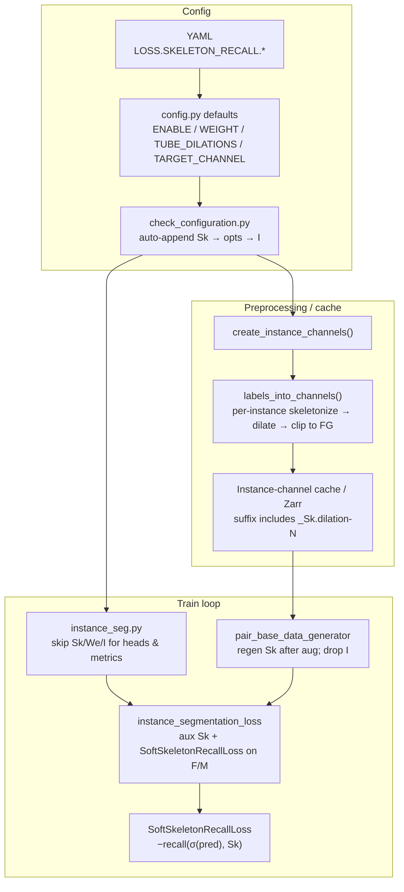
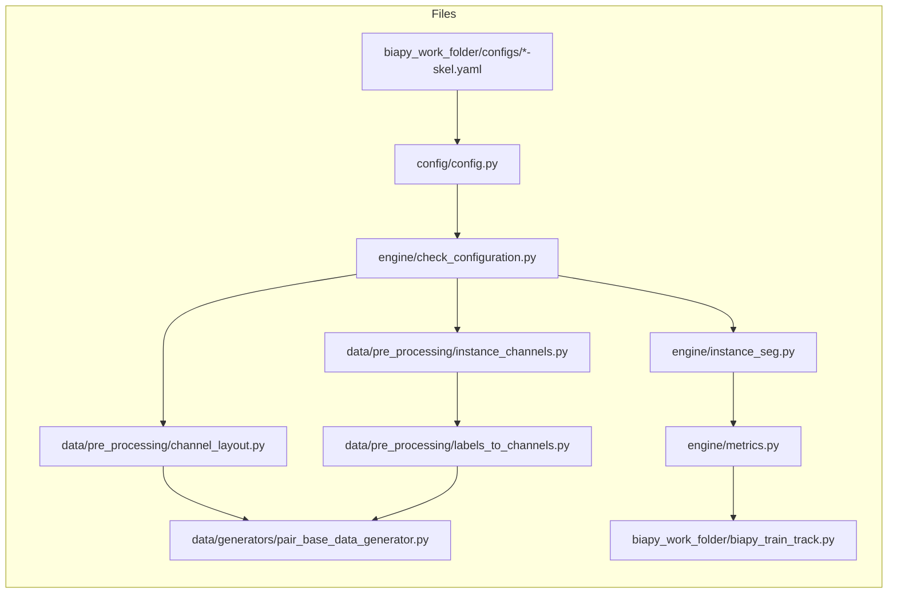
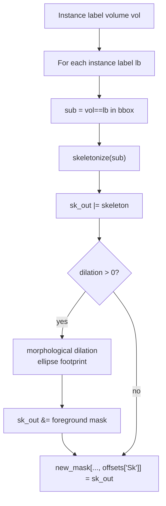
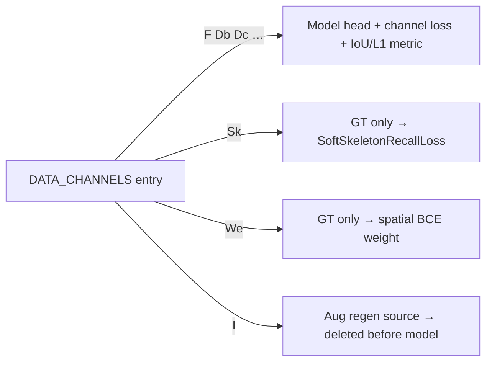

# Soft Skeleton Recall Loss — Wiring Guide

How Soft Skeleton Recall (Kirchhoff / nnU-Net Skeleton-Recall) is enabled and connected
across **BiaPy-novabro** and this project’s configs/checks.

> **Not the same as clDice.** Membrane-repair `CLDiceComponentPenaltyLoss` soft-skeletonizes
> both prediction and GT at train time. Skeleton Recall uses a **hard tubed-skeleton GT
> channel `Sk`** and only scores recall of that skeleton under a soft foreground prediction
> (`F` or `M`).

---

## 1. End-to-end picture



**Minimal user action:** set `LOSS.SKELETON_RECALL.ENABLE: True` (and usually `TARGET_CHANNEL: F`)
in a YAML whose `DATA_CHANNELS` already include `F` or `M`. Everything else is auto-wired.

---

## 2. Config keys and defaults

| Key | Default | Meaning |
|-----|---------|---------|
| `LOSS.SKELETON_RECALL.ENABLE` | `False` | When `True`, append aux channel `Sk` (and usually `I`) |
| `LOSS.SKELETON_RECALL.WEIGHT` | `1.0` | Multiplier on the Soft Skeleton Recall term |
| `LOSS.SKELETON_RECALL.TUBE_DILATIONS` | `1` | Tube radius around the centreline (int or per-axis list) → stored as `DATA_CHANNELS_EXTRA_OPTS['Sk']['dilation']` |
| `LOSS.SKELETON_RECALL.TARGET_CHANNEL` | `"F"` | Predicted channel supervised by recall; must be `"F"` or `"M"` and present in `DATA_CHANNELS` |

**Defined in:** `BiaPy-novabro/biapy/config/config.py` (`_C.LOSS.SKELETON_RECALL`).

**Project examples:**

- `biapy_work_folder/configs/biapy-aug-zarr-seunet-FDb-skel.yaml` — `DATA_CHANNELS: [F, Db]` + Skeleton Recall
- `biapy_work_folder/configs/biapy-aug-zarr-seunet-FDcDn-skel.yaml` — `DATA_CHANNELS: [F, Dc, Dn]` + Skeleton Recall

You do **not** list `Sk` (or `I`) in the YAML `DATA_CHANNELS`; `check_configuration` appends them.

---

## 3. Channel roles

| Channel | Predicted? | In loss? | Role |
|---------|------------|----------|------|
| `F` / `M` | Yes | Yes (BCE/etc.) | Foreground map; **Skeleton Recall supervises this** |
| `Db` / `Dc` / … | Yes | Yes | Other instance targets (unchanged) |
| `Sk` | **No** | Yes (aux GT only) | Hard tubed skeleton target for Soft Skeleton Recall |
| `We` | **No** | Spatial weight only | Optional U-Net-style border weights |
| `I` | **No** | No (dropped) | Raw instance labels so geometry-derived targets (`Sk`, flows, …) can be **regenerated after augmentation** |

Order after config mutation (typical FDb-skel):

```text
DATA_CHANNELS: ['F', 'Db', 'Sk', 'I']
                 ▲ predicted   ▲ aux GT   ▲ regen labels (dropped before model)
```

If `BORDER_EXTRA_WEIGHTS: unet-like` is also on: `…, We, Sk, I` (`We` then `Sk`, `I` always last).

---

## 4. File / symbol map



| File | Symbol | What it does for Skeleton Recall |
|------|--------|----------------------------------|
| `biapy/config/config.py` | `_C.LOSS.SKELETON_RECALL` | Declares ENABLE / WEIGHT / TUBE_DILATIONS / TARGET_CHANNEL |
| `biapy/engine/check_configuration.py` | instance-seg block (~664–688) | Appends `Sk`, fills `Sk.dilation`, validates TARGET_CHANNEL, appends `I` when regen needed, builds cache **suffix**, skips `Sk` in auto `DATA_CHANNELS_LOSSES` |
| `biapy/data/pre_processing/channel_layout.py` | `instance_channel_needs_regen("Sk")` | Always `True` — warped thin centreline ≠ skeleton of warped mask |
| `biapy/data/pre_processing/labels_to_channels.py` | `labels_into_channels` (`Sk` block) | Per-instance `skeletonize` → optional `dilation` → clip to foreground → write `Sk` column |
| `biapy/data/pre_processing/instance_channels.py` | `create_instance_channels` | Offline preprocessing that calls `labels_into_channels` into the channel cache |
| `biapy/data/generators/pair_base_data_generator.py` | `regen_mask_map` + `__getitem__` | After spatial aug: regenerate `Sk` from `I`; `np.delete(..., instance_channel)` drops `I` |
| `biapy/engine/instance_seg.py` | head / metric / loss setup | Skips `I`/`We`/`Sk` for heads & train metrics; constructs `instance_segmentation_loss(..., skeleton_recall_weight=…, skeleton_target_channel=…)` |
| `biapy/engine/metrics.py` | `SoftSkeletonRecallLoss` | \(-\mathrm{recall}(\sigma(\hat y), S_k)\) |
| `biapy/engine/metrics.py` | `instance_segmentation_loss` | Treats `Sk` as aux GT; adds weighted Soft Skeleton Recall on `F`/`M` |
| `biapy/engine/metrics.py` | `multiple_metrics` | Filters `We`/`I`/`Sk` out of scored channels |
| `biapy_work_folder/biapy_train_track.py` | `_KNOWN_METRIC_ALIASES` | Maps `"skeleton recall"` → `skel_recall` (logging alias; term itself is folded into total loss today) |

---

## 5. Config mutation (auto-append)

**Where:** `check_configuration.py` after other instance-channel option fills.

```text
user YAML:  DATA_CHANNELS = [F, Db]
            LOSS.SKELETON_RECALL.ENABLE = True
            LOSS.SKELETON_RECALL.TUBE_DILATIONS = 1
            LOSS.SKELETON_RECALL.TARGET_CHANNEL = F

after check_configuration:
  1. if ENABLE and "Sk" not in channels → append "Sk"
  2. DATA_CHANNELS_EXTRA_OPTS[0]["Sk"] = { "dilation": TUBE_DILATIONS (or existing) }
  3. assert TARGET_CHANNEL ∈ {F, M} and ∈ DATA_CHANNELS
  4. because instance_channel_needs_regen("Sk") → append "I" (if missing)
  5. DATA_CHANNELS_LOSSES auto-list skips We / Sk / I
  6. cache folder suffix includes _Sk.dilation-1 (etc.) → **new preprocess cache**
```

`DATA_CHANNEL_WEIGHTS` stay aligned with **predicted** channels only (`F`, `Db`, …), not `Sk`/`I`.

---

## 6. GT generation: how `Sk` is built

**Function:** `labels_into_channels(..., mode, channel_extra_opts)` in `labels_to_channels.py`.



Details:

- Skeletonized **per instance**, then OR’d so touching neurons keep separate centrelines.
- Dilation builds a “tube” around the centreline; tube is clipped back to foreground so thin neurites are not overspread.
- Saved debug name when `save_dir` is set: `*_tubed_skeleton.tif`.

Offline path: `create_instance_channels(cfg)` → `labels_into_channels`.  
Online path (after aug): generator takes augmented `I`, calls `labels_into_channels` again for regen columns (`Sk`, affinities, …).

---

## 7. Batch tensor layout at loss time

After the generator drops `I`, a typical FDb-skel batch GT channel axis is:

```text
y_true:  [ F | Db | Sk ]     # We would sit before Sk if enabled
y_pred:  [ F | Db ]          # model never predicts Sk
```

Inside `instance_segmentation_loss`:

| Attribute | Typical value (FDb-skel) |
|-----------|--------------------------|
| `out_channels` (predicted) | `['F', 'Db']` |
| `aux_gt_channels` | `['Sk']` (or `['We','Sk']`) |
| `use_skeleton_recall` | `True` |
| `skeleton_target_channel` | `'F'` |
| `skeleton_recall_weight` | `cfg.LOSS.SKELETON_RECALL.WEIGHT` |
| `gt_channels_expected` | `#predicted + #aux` |

`_aux_gt(y_true)` slices the **trailing** aux slots:

```python
# last len(aux_gt_channels) channels of y_true
aux = {"Sk": y_true[:, -1]}           # or We then Sk if both present
```

---

## 8. Loss computation

### SoftSkeletonRecallLoss

```text
ŷ = sigmoid(y_pred)           # C==1 (binary F)
# or softmax, drop bg channel  # C>1

recall = (Σ ŷ·Sk + ε) / (Σ Sk + ε)     # ε = smooth = 1.0
loss   = −mean(recall)
```

Minimizing this **maximizes** soft recall of skeleton voxels.

### Wiring in `instance_segmentation_loss.__call__`

```text
for each deep-supervision output pd:
    inter_output_loss  = Σ_i  channel_weights[i] * L_i(pd_i, gt_i)   # BCE/L1/…
    if use_skeleton_recall:
        pred_f = pd[:, index(TARGET_CHANNEL)]      # F or M logits
        inter_output_loss += WEIGHT * SoftSkeletonRecallLoss(pred_f, Sk)
    total += deep_sup_weight * inter_output_loss
```

Constructed from `instance_seg.py`:

```python
instance_segmentation_loss(
    ...,
    out_channels=cfg.PROBLEM.INSTANCE_SEG.DATA_CHANNELS,  # still includes Sk/I names
    losses_to_use=cfg.PROBLEM.INSTANCE_SEG.DATA_CHANNELS_LOSSES,
    skeleton_recall_weight=cfg.LOSS.SKELETON_RECALL.WEIGHT,
    skeleton_target_channel=cfg.LOSS.SKELETON_RECALL.TARGET_CHANNEL,
)
```

---

## 9. What is *not* predicted / scored



Guards (all must agree):

- `instance_seg.py` head loop: `continue` on `I`/`We`/`Sk`
- `instance_seg.py` `define_metrics`: no metric for `Sk`
- `multiple_metrics`: filters `We`/`I`/`Sk`
- Auto `DATA_CHANNELS_LOSSES`: no entry for `Sk`

---

## 10. How to enable it (checklist)

1. Start from a working instance-seg YAML with `F` or `M` in `DATA_CHANNELS`.
2. Add:

```yaml
LOSS:
  SKELETON_RECALL:
    ENABLE: True
    WEIGHT: 1.0
    TUBE_DILATIONS: 1
    TARGET_CHANNEL: F
```

3. **Re-run preprocessing** — cache folder suffix changes when `Sk` (and `I`) appear.
4. Train/test as usual (e.g. `./sbatch/biapy/biapy-py_sbatch_chain.sh biapy-aug-zarr-seunet-FDb-skel preprocessing train test`).

### Gotchas

| Gotcha | Why |
|--------|-----|
| Must re-preprocess | Suffix includes `_Sk.dilation-…` and usually `_I` |
| Need `F` or `M` | Soft Skeleton Recall needs a probability map; `Db`-only fails |
| `Sk` is not a head | Do not put `Sk` in `CHANNELS_PER_HEAD_INFO` counts as a predicted channel |
| Augmentations warp geometry | `Sk` is always regenerated from `I` after spatial aug |
| Not clDice | No soft-skeletonize of the prediction |
| Metric alias vs logged term | `skel_recall` alias exists in `biapy_train_track.py`; the recall term is currently **inside the scalar loss**, not a separate train metric column from `define_metrics` |

---

## 11. Variable cheat-sheet

| Name | Location | Role |
|------|----------|------|
| `cfg.LOSS.SKELETON_RECALL.*` | config | User/runtime switches |
| `cfg.PROBLEM.INSTANCE_SEG.DATA_CHANNELS` | mutated cfg | Logical channel list incl. aux |
| `DATA_CHANNELS_EXTRA_OPTS['Sk']['dilation']` | mutated cfg | Tube radius used by `labels_into_channels` |
| `instance_channel_needs_regen` | `channel_layout.py` | Forces `I` + online regen for `Sk` |
| `regen_mask_map` | data generator | `(mask_pos, full_col)` pairs to overwrite after aug |
| `aux_gt_channels` | `instance_segmentation_loss` | `['We'?, 'Sk']` trailing GT |
| `use_skeleton_recall` | `instance_segmentation_loss` | `"Sk" in aux_gt_channels` |
| `skeleton_target_channel` | `instance_segmentation_loss` | `'F'` or `'M'` index into predicted channels |
| `skeleton_recall_loss` | `instance_segmentation_loss` | `SoftSkeletonRecallLoss()` instance |
| `skeleton_recall_weight` | `instance_segmentation_loss` | Scalar λ from WEIGHT |

---

## 12. Verification scripts (this repo)

| Script | Phase | Checks |
|--------|-------|--------|
| `biapy_work_folder/check_skeleton_recall_loss.py` | A1 | `SoftSkeletonRecallLoss` numerics |
| `biapy_work_folder/check_instance_skel_loss.py` | A2 | Wiring into `instance_segmentation_loss` (incl. We+Sk, missing F/M) |
| `biapy_work_folder/check_skeleton_channel.py` | channel | Offline `Sk` generation on a crop |
| `biapy_work_folder/check_skeleton_phase_b.py` | B | Auto-append, regen flag, offsets |
| `biapy_work_folder/check_skeleton_phase_c.py` | C | Head/metric skips + loss ctor from cfg |
| `biapy_work_folder/check_skeleton_phase_d.py` | D | Load FDb-skel YAML + train-track alias |

Run inside the BiaPy Singularity overlay (see repo `CLAUDE.md`), not on a bare login node if GPU/env packages are required; the CPU unit checks can run with the env activated.

---

## 13. Quick reference: call chain

```text
YAML (ENABLE=True)
  → config defaults merge
  → check_configuration: append Sk + I, set Sk.dilation, validate TARGET_CHANNEL
  → create_instance_channels → labels_into_channels (write Sk into cache)
  → DataLoader / pair_base_data_generator
        augment → regenerate Sk from I → drop I
  → InstanceSegmentation.prepare_model / define_metrics / define_loss
        skip Sk for heads & IoU/L1 metrics
        instance_segmentation_loss(..., skeleton_recall_weight, skeleton_target_channel)
  → forward: L_channels + WEIGHT * SoftSkeletonRecallLoss(pred[F|M], Sk)
```
