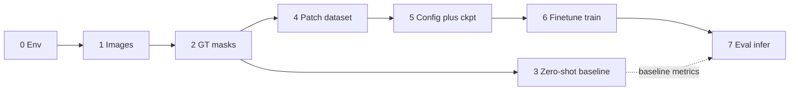

# vesselFM on FISBe — staged plan to fine-tune

**End goal:** fine-tune [vesselFM](https://github.com/bwittmann/vesselFM) on
**FISBe completely/train** so the model adapts to our light-microscopy neurons
(binary semantic foreground), then evaluate on the held-out completely/test set.

vesselFM does **not** output instance IDs. Training here means **semantic
foreground (tubular) segmentation** — a baseline / prior for BiaPy or
PatchPerPix, not a replacement for instance segmentation or NBLAST-ready labels.

**Model:** MONAI `DynUNet`, 1→1 channels, `input_size=[128,128,128]`
(`vesselFM/vesselfm/seg/configs/model/dyn_unet_base.yaml`).

**Repo root for all SLURM submits:** `/scratch/wmz2007/neuroinfo_fruitfly`.
Inside sbatch scripts prefer `SLURM_SUBMIT_DIR` as repo root (Slurm may copy the
script to a spool path; do not rely on `BASH_SOURCE` alone).

**Canonical reference in-repo:** this file. Upstream finetune docs:
`vesselFM/vesselfm/seg/README.md`.

---

## Roadmap (status snapshot)

```text
Stage 0  Env overlay                         [DONE]
Stage 1  Convert all splits → images         [DONE]
Stage 2  Convert all splits → binary GT      [DONE]
Stage 3  Zero-shot baseline on test          [DONE — see vesselfm_stage3_zeroshot.md]
Stage 4  Build finetune patch dataset        [SMOKE DONE — full patches later; vesselfm_stage4_patches.md]
Stage 5  Hydra config + pretrained ckpt      [DONE — see vesselfm_stage5_config_ckpt.md]
Stage 6  Fine-tune on FISBe (GPU sbatch)     [SMOKE SUBMITTED — see vesselfm_stage6_finetune.md]
Stage 7  Infer + score with finetuned ckpt   [TODO]
```



### Artifact map

| Artifact | Path |
|----------|------|
| Upstream clone | `vesselFM/` |
| Converter | `vesselFM/convert_fisbe_zarr_to_nii.py` |
| Overlay | `env/vesselfm.ext3` → conda env `vesselfm` |
| Install sbatch | `sbatch/vesselfm/vesselfm_env_install_sbatch.sh` |
| Convert images sbatch | `sbatch/vesselfm/vesselfm_convert_images_sbatch.sh` |
| Convert masks sbatch (Stage 2) | `sbatch/vesselfm/vesselfm_convert_masks_sbatch.sh` |
| Prepare patches sbatch (Stage 4) | `sbatch/vesselfm/vesselfm_prepare_patches_sbatch.sh` |
| Finetune sbatch (Stage 6) | `sbatch/vesselfm/vesselfm_finetune_sbatch.sh` |
| Patch builder | `vesselFM/prepare_fisbe_finetune_patches.py` |
| Ckpt wrap | `vesselFM/wrap_vesselfm_ckpt.py` |
| Data config | `vesselFM/vesselfm/seg/configs/data/eval_fisbe.yaml` |
| Stage 2 detail | `md_guides/vesselfm_stage2_masks.md` |
| Stage 3 detail | `md_guides/vesselfm_stage3_zeroshot.md` |
| Stage 4 detail | `md_guides/vesselfm_stage4_patches.md` |
| Stage 5 detail | `md_guides/vesselfm_stage5_config_ckpt.md` |
| Stage 6 detail | `md_guides/vesselfm_stage6_finetune.md` |
| Infer sbatch | `sbatch/vesselfm/vesselfm_inference_sbatch.sh` |
| Infer entry | `vesselFM/vesselfm/seg/inference.py` |
| Train entry | `vesselFM/vesselfm/seg/finetune.py` |
| Dataset class | `vesselFM/vesselfm/seg/dataset.py` (`UnionDataset`) |
| Flat NIfTI images/masks | `fisbe/vesselfm-fisbe/{train,val,test}` + `*_masks/` |
| Patch finetune root (planned) | `fisbe/vesselfm-fisbe-finetune/` |
| Finetune ckpts (planned) | `metrics/vesselfm/finetune_ckpts/` |
| Wrapped / exported weights (planned) | `metrics/vesselfm/checkpoints/` |
| HF cache | `.cache/huggingface/` (`HF_HOME`) |

### Completely-split sizes (planning)

| Split | Zarrs under `fisbe/completely/` | Flat NIfTI images | Masks |
|-------|----------------------------------|-------------------|-------|
| train | ~18 | `fisbe/vesselfm-fisbe/train/` (~2.2 G) | **missing** (`train_masks/`) |
| val | ~5 | `fisbe/vesselfm-fisbe/val/` (~477 M) | **missing** (`val_masks/`) |
| test | ~7 | `fisbe/vesselfm-fisbe/test/` (~768 M) | `test_masks/` done |

Test channel-MIP NIfTIs are roughly 80–120 MB each. Example raw Zarr shape:
`[3, ~390, ~680, ~680]` `uint16` → MIP `[Z,Y,X]`.

### Runtime activation (every GPU/CPU job after Stage 0)

```bash
singularity exec --nv --overlay env/vesselfm.ext3:ro \
  /share/apps/images/cuda12.1.1-cudnn8.9.0-devel-ubuntu22.04.2.sif \
  /bin/bash -c 'source /ext3/env.sh; conda activate vesselfm; …'
```

Omit `--nv` for CPU-only convert jobs. Never `:rw` the overlay while another job
uses it; never run `:ro` inference/train while an install job has `:rw`.

---

## Stage 0 — Singularity / conda overlay `[DONE]`

### Purpose

GPU/CPU jobs activate vesselFM from `/ext3` without depending on a login-node
conda env such as `/scratch/wmz2007/miniforge3/envs/vesselfm`. This matches the
repo-wide container-first rule.

### What already exists

- Overlay file: `env/vesselfm.ext3` (~25 GB ext3, gitignored under `env/`).
- Conda env name: `vesselfm` at `/ext3/miniforge3/envs/vesselfm`.
- Packages from `vesselFM/requirements.txt` (pinned: `torch==2.5.1`,
  `monai==1.3.2`, `lightning==2.4.0`, `hydra-core`, `SimpleITK`, …) plus `zarr`
  (needed by our FISBe converter).
- Editable install of the local clone plus **`vesselfm_src.pth`** in
  site-packages pointing at `…/vesselFM`.

Why the `.pth` matters: `setup.py` uses `find_packages()`, which returns `[]`
for this PEP 420 namespace tree (no `__init__.py` under `vesselfm/`). Without
the `.pth`, `import vesselfm` fails unless cwd is `vesselFM/`.

### How to (re)install

```bash
# from repo root — CPU partition; ONE writer only
sbatch sbatch/vesselfm/vesselfm_env_install_sbatch.sh
```

| Detail | Value |
|--------|--------|
| Partition | `cpu_short` |
| Resources | 4 cpus, 32 g, 2 h, `torch_pr_61_general` |
| Mount | `singularity exec --fakeroot --overlay env/vesselfm.ext3:rw` |
| Image | `/share/apps/images/cuda12.1.1-cudnn8.9.0-devel-ubuntu22.04.2.sif` |
| Do **not** use | `:rw` + `--writable-tmpfs` (rejected on apptainer 1.5.1) |

Inside the container the script:

1. `source /ext3/env.sh`
2. Create or reuse conda env `vesselfm` (Python 3.9)
3. `pip install -r vesselFM/requirements.txt`
4. `pip install zarr`
5. `pip install -e .` from `vesselFM/`
6. Write `site-packages/vesselfm_src.pth` → absolute path to `vesselFM/`
7. Import check from `/` (not from source cwd)

### Pitfalls

- Never mount the same overlay `:rw` from two jobs.
- Do not run inference/train `:ro` while an install `:rw` job is writing.
- Fakeroot may log “User not listed in /etc/subuid”; that is expected on Greene.
- If imports work only when `cd vesselFM`, the `.pth` is missing or stale —
  re-run the install sbatch.

### Exit criterion

`conda activate vesselfm` + `import torch, monai, vesselfm` works from any cwd
under `:ro`.

---

## Stage 1 — Convert FISBe Zarr → NIfTI images `[DONE]`

### Purpose

vesselFM inference (`inference.py`) reads folders of `.nii.gz`, not Zarr.
Fine-tune patches (Stage 4) can start from these NIfTIs or from Zarr directly;
having flat images also enables Stage 3 zero-shot scoring.

### Status

All completely-split images are converted with stem parity to Zarr:

| Split | Count | Output |
|-------|-------|--------|
| train | 18 | `fisbe/vesselfm-fisbe/train/` |
| val | 5 | `fisbe/vesselfm-fisbe/val/` |
| test | 7 | `fisbe/vesselfm-fisbe/test/` |

### Canonical command

```bash
# from repo root — CPU job; skips existing .nii.gz (no --overwrite)
sbatch sbatch/vesselfm/vesselfm_convert_images_sbatch.sh
```

The sbatch mounts `env/vesselfm.ext3:ro`, activates `vesselfm`, converts
`train`/`val`/`test`, then fails the job if any split’s Zarr↔NIfTI stems differ.

### Converter behavior

Script: `vesselFM/convert_fisbe_zarr_to_nii.py`.

| Flag | Default | Role |
|------|---------|------|
| `--input-dir` | required | Dir of `*.zarr` stores |
| `--output-dir` | required | Dir for `<stem>.nii.gz` |
| `--array-key` | `volumes/raw` | Path inside the Zarr |
| `--spacing` | `1 1 1` | Written into NIfTI header (sx sy sz) |
| `--overwrite` | off | Skip existing files unless set |
| `--binarize` | off | Stage 2 only |

Logic:

1. Discover `input_dir/*.zarr` directories (sorted).
2. Open array at `--array-key`.
3. If **4D CZYX** → channel-wise max projection to ZYX (streams channels so the
   full C×Z×Y×X cube need not fit in RAM at once).
4. If **3D** → write as-is (used for FG masks in Stage 2).
5. `SimpleITK.GetImageFromArray` + `WriteImage` → `.nii.gz`.

### Manual one-split re-run (if needed)

```bash
singularity exec --overlay env/vesselfm.ext3:ro \
  /share/apps/images/cuda12.1.1-cudnn8.9.0-devel-ubuntu22.04.2.sif \
  /bin/bash -c '
    source /ext3/env.sh; conda activate vesselfm
    python -u vesselFM/convert_fisbe_zarr_to_nii.py \
      --input-dir fisbe/completely/train \
      --output-dir fisbe/vesselfm-fisbe/train
  '
```

### Pitfalls

- Stem is the Zarr directory name without `.zarr` — must match Stage 2 masks.
- Default spacing `1 1 1` is fine for vesselFM’s isotropic check; real FISBe
  anisotropy is not encoded unless you pass `--spacing`.
- Re-run is safe (skips existing). Pass `--overwrite` only if regenerating
  (e.g. spacing change).

### Exit criterion (met)

Counts 18/5/7 and empty stem parity for train/val/test:

```bash
for split in train val test; do
  comm -3 \
    <(ls -d "fisbe/completely/${split}/"*.zarr | xargs -n1 basename | sed 's/\.zarr$//' | sort) \
    <(ls "fisbe/vesselfm-fisbe/${split}/"*.nii.gz | xargs -n1 basename | sed 's/\.nii\.gz$//' | sort)
done
```

---

## Stage 2 — Convert matching binary GT `[DONE]`

> Detailed execution plan: [`vesselfm_stage2_masks.md`](vesselfm_stage2_masks.md).
> Completed via job `17846666` (`sbatch/vesselfm/vesselfm_convert_masks_sbatch.sh`).
> Counts: train 18 / val 5 / test 7 masks; image↔mask basename parity OK.

### Purpose

1. Provide `mask_path` for Dice/clDice during inference (Stages 3 and 7).
2. Provide source masks for Stage 4 patch extraction (train + val required for
   fine-tuning; test required for fair evaluation).

### Label choice

| Array | Shape | Use? |
|-------|-------|------|
| `volumes/gt_fg_rm_5` | 3D `float32` ZYX | **Yes** — binary FG after opening/rm |
| `volumes/gt_instances` / `_rm_5` | 4D CZYX instance labels | **No** — multi-instance; vesselFM is binary |
| `volumes/gt_numinst` | 3D | No — count map |

`--binarize` writes `(volume > 0).astype(uint8)`.

### Inference layout constraint

`inference.get_paths` builds mask paths as:

```python
mask_paths = [Path(cfg.mask_path) / f"{p.name}" for p in image_paths]
```

So:

- Images and masks must live in **different directories**.
- Filenames must be **identical** (e.g. both `R14A02-….nii.gz`).
- Do **not** dump masks into the image folder (they would be treated as images).

Recommended layout:

```text
fisbe/vesselfm-fisbe/test/         # images
fisbe/vesselfm-fisbe/test_masks/   # GT, same basenames
fisbe/vesselfm-fisbe/train/
fisbe/vesselfm-fisbe/train_masks/
fisbe/vesselfm-fisbe/val/
fisbe/vesselfm-fisbe/val_masks/
```

### Commands (still needed for train + val)

Run inside the vesselfm container (or wrap in a small CPU sbatch modeled on
`vesselfm_convert_images_sbatch.sh`):

```bash
for split in train val; do
  python vesselFM/convert_fisbe_zarr_to_nii.py \
    --input-dir "fisbe/completely/${split}" \
    --output-dir "fisbe/vesselfm-fisbe/${split}_masks" \
    --array-key volumes/gt_fg_rm_5 \
    --binarize
done
```

`test_masks/` is already done; re-run with `--overwrite` only if regenerating.

### Parity and shape checks

```bash
# basename parity (empty comm -3 = OK)
for split in train val test; do
  echo "=== ${split} ==="
  comm -3 \
    <(ls "fisbe/vesselfm-fisbe/${split}/"*.nii.gz | xargs -n1 basename | sort) \
    <(ls "fisbe/vesselfm-fisbe/${split}_masks/"*.nii.gz | xargs -n1 basename | sort)
done
```

Optional shape check (SimpleITK): for each stem, image and mask ZYX shapes must
match. The converter uses the same Zarr spatial grid for `raw` MIP vs
`gt_fg_rm_5`, so mismatches usually mean a bad/partial write — delete and
reconvert that stem.

### Status

| Split | Masks |
|-------|--------|
| test | Done |
| train | **Still needed** |
| val | **Still needed** |

### Exit criterion

All three splits have paired image/mask folders with identical basenames and
matching spatial shapes.

---

## Stage 3 — Zero-shot baseline on test `[DONE]`

> Detailed notes + archived metrics: [`vesselfm_stage3_zeroshot.md`](vesselfm_stage3_zeroshot.md).
> Job `17353283`: mean Dice **0.0618**, mean clDice **0.0454** (7/7 preds present).
> No re-submit required unless regenerating the baseline.

### Purpose

Score **pretrained** vesselFM on FISBe completely/test **before** fine-tuning.
Archive mean Dice/clDice so Stage 7 can claim a real gain (or detect regression).

Optional before Stage 6, but required before claiming fine-tune improvements in
Stage 7.

### Submit

```bash
sbatch sbatch/vesselfm/vesselfm_inference_sbatch.sh
```

| SLURM | Value |
|-------|--------|
| Job name | `vesselfm-infer-test` |
| GPU | 1× `h100\|h200`, 8 cpus, 128 g, 8 h |
| Account | `torch_pr_61_general` |
| Logs | `sbatch/vesselfm/%x-%j.{out,err}` |
| GPU CSV | `gpu_log/gpu_vesselfm_infer_test_${SLURM_JOB_ID}.csv` |

### Paths the sbatch hard-codes today

| Variable | Path |
|----------|------|
| `IMAGE_PATH` | `fisbe/vesselfm-fisbe/test` |
| `MASK_PATH` | `fisbe/vesselfm-fisbe/test_masks` |
| `OUTPUT_FOLDER` | `metrics/vesselfm/fisbe-completely-test` |
| `HF_HOME` | `.cache/huggingface` |

Hydra overrides: `image_path`, `mask_path`, `output_folder`, `device=cuda:0`.
`ckpt_path` is left as the default broken placeholder so `load_model` falls
through to Hugging Face `bwittmann/vesselFM` → `vesselFM_all.pt` (raw
`state_dict`).

### Inference algorithm (what you will see)

From `vesselfm/seg/inference.py` + `configs/inference.yaml`:

1. Load DynUNet; sliding window `patch_size=[128,128,128]`, `batch_size=8`,
   `overlap=0.5`.
2. Per volume: read NIfTI; if spacing anisotropic, resample to isotropic
   (duplicate min spacing or min of three).
3. Percentile scale `lower=1`, `upper=99` → `[0,1]`.
4. Optional TTA (`scales`, `invert`, `equalize_hist`) — defaults off / scale 1.
5. Sigmoid → threshold `merging.threshold=0.5` → optional
   `remove_small_objects` (`post.apply=false` by default).
6. Write `<stem>_pred.nii.gz` and `<stem>_img.nii.gz`.
7. If `mask_path` set: log per-volume **Dice** and **clDice**; print means.

### Tunables for light microscopy (if scores look bad)

Edit Hydra overrides or `inference.yaml`:

| Knob | Default | Notes for FISBe LM |
|------|---------|---------------------|
| `transforms_config` percentiles | 1–99 | Try wider/narrower |
| `tta.invert` | `false` | Try `true` if contrast is inverted vs vessel CT/MR |
| `merging.threshold` | `0.5` | Finetune module metrics use `0.62`; keep Stage 3/7 consistent when comparing |
| `post.apply` | `false` | Set `true` to drop small components |

### Where to read results

- Metrics: job `.out` / `.err` under `sbatch/vesselfm/`.
- Preds: `metrics/vesselfm/fisbe-completely-test/*_pred.nii.gz`.
- GPU util: `gpu_log/gpu_vesselfm_infer_test_*.csv`.

### Exit criterion

Mean Dice/clDice recorded for all 7 test volumes; prediction NIfTIs exist.

---

## Stage 4 — Build finetune patch dataset `[SMOKE DONE]`

> Detailed plan: [`vesselfm_stage4_patches.md`](vesselfm_stage4_patches.md).
> Script: `vesselFM/prepare_fisbe_finetune_patches.py`.
> Smoke job `17846712`: 72/10/14 patches. Full rebuild (`PATCHES_TRAIN=32`) still TODO.

### Purpose

Produce the on-disk layout that `UnionDataset` expects when `finetune=True`.
This is the **largest coding effort** and the hard blocker for Stage 6.

Fine-tune on “FISBe completely/train” means: extract many patches whose
membership comes **only** from `fisbe/completely/train` (do not mix val/test).

### Why flat full-volume NIfTI is not enough

`dataset.py` (simplified):

```python
data_dir = Path(dataset_config.path) / mode   # …/train, …/val, …/test
paths = sorted(list(data_dir.iterdir()))      # each child = one sample dir
# inside sample dir:
img_path  = [p for p in sample_id.iterdir() if "img" in p.name][0]
mask_path = [p for p in sample_id.iterdir() if "mask" in p.name][0]
```

`default_finetune.yaml` sets `file_format: "npy"` and train transforms that
**center-crop** to `${input_size}` = `[128,128,128]`. Feeding one full
~400×680×680 volume per sample wastes almost all FG and is a poor few-shot /
full-train set.

Also: `finetune.py` does `Subset(train, range(num_shots))` on **sorted** train
children — the first N folders are the few-shot set. Patch quality and sort
order matter.

### Target layout

```text
fisbe/vesselfm-fisbe-finetune/
  train/
    0/img.npy      # float32, shape (128,128,128) or slightly larger pre-crop
    0/mask.npy     # bool or {0,1}, same spatial shape
    1/img.npy
    1/mask.npy
    ...
  val/
    0/...
  test/
    0/...
```

Notes:

- Sample folder names should sort stably (`0`, `1`, … or zero-padded `0001`).
- Filenames **must** contain the substrings `img` and `mask` (e.g. `img.npy`,
  `mask.npy`).
- Val/test transforms do **not** center-crop to 128³; they percentile-scale and
  tensorize full arrays, then `PLModuleFinetune` runs **sliding-window**
  inference. For val/test you can store either full volumes or large patches;
  full volumes are closer to Stage 3/7 evaluation but heavier. Patches of
  128³+ with FG are fine for faster iteration.
- Keep splits strict: train patches only from `completely/train`, etc.

### Implementation plan for a new script

Suggested path: `vesselFM/prepare_fisbe_finetune_patches.py`.

1. **Inputs:** Stage 1/2 NIfTI pairs, **or** Zarr `volumes/raw` + `gt_fg_rm_5`
   directly (avoids double conversion; recommended if masks NIfTIs are not ready
   yet — still finish Stage 2 for inference scoring).
2. **Split membership:** walk `fisbe/completely/{train,val,test}` only.
3. **Image prep:** for Zarr raw, channel-MIP to ZYX (same as converter).
4. **Mask prep:** load `gt_fg_rm_5`, binarize `(>0)`.
5. **Patch sampling (train):**
   - Target size `(128,128,128)` (or slightly larger if relying on train
     `CenterSpatialCropd`).
   - Prefer FG-aware crops: sample centers where `mask > 0` (MONAI
     `RandCropByPosNegLabeld`, or FG crop + `RandSpatialCropd` as in
     `vesselfm/d_real/extract_patches.py`).
   - Aim for many patches per volume (e.g. tens–hundreds) so few-shot and
     fuller training both have diversity.
   - Skip empty / near-empty patches (min FG voxel fraction threshold, e.g.
     0.001–0.01 — tune after inspecting FG density).
6. **Intensity:** store raw (or lightly normalized) float32; train transforms
   apply `ScaleIntensityd` 0–1; val/test use percentile scaling in
   `default_finetune.yaml`.
7. **Write:** `np.save` `img.npy` / `mask.npy`; mask as `bool` or `uint8`.
8. **Manifest (optional but useful):** CSV of
   `split, sample_id, source_volume, zyx_origin` for reproducibility.
9. **CLI knobs:** `--patch-size`, `--patches-per-volume`, `--min-fg-frac`,
   `--seed`, `--splits train,val,test`, `--output-root`.

Reference code:

- Offline patch + aug loop: `vesselfm/d_real/extract_patches.py`
  (`crop_fg`, `RandSpatialCropd`, flips, rotates, elastic).
- Reader selection: `vesselfm/seg/utils/io.py` (`determine_reader_writer`).
- Dataset contract: `vesselfm/seg/dataset.py` (`UnionDataset`).

### Suggested CPU sbatch (to add)

Mirror `vesselfm_convert_images_sbatch.sh`:

- Partition `cpu_short` (or longer if many patches).
- Mount `env/vesselfm.ext3:ro`.
- Run `prepare_fisbe_finetune_patches.py` writing to
  `fisbe/vesselfm-fisbe-finetune/`.

### Sanity checks

```bash
# counts
find fisbe/vesselfm-fisbe-finetune/train -mindepth 1 -maxdepth 1 -type d | wc -l
find fisbe/vesselfm-fisbe-finetune/val   -mindepth 1 -maxdepth 1 -type d | wc -l
find fisbe/vesselfm-fisbe-finetune/test  -mindepth 1 -maxdepth 1 -type d | wc -l

# one sample loads
singularity exec --overlay env/vesselfm.ext3:ro \
  /share/apps/images/cuda12.1.1-cudnn8.9.0-devel-ubuntu22.04.2.sif \
  /bin/bash -c '
  source /ext3/env.sh; conda activate vesselfm
  python - <<PY
import numpy as np
from pathlib import Path
p = Path("fisbe/vesselfm-fisbe-finetune/train/0")
img, mask = np.load(p/"img.npy"), np.load(p/"mask.npy")
print(img.shape, img.dtype, mask.shape, mask.dtype, float(mask.mean()))
assert img.shape == mask.shape
PY'
```

Also spot-check mean FG fraction across many train patches; if near zero,
sampling is broken.

### Exit criterion

Non-trivial train patch count; `UnionDataset` can index train/val/test; average
FG fraction in train patches clearly > 0.

---

## Stage 5 — Hydra config + pretrained checkpoint `[DONE]`

> Detail: [`vesselfm_stage5_config_ckpt.md`](vesselfm_stage5_config_ckpt.md).
> `eval_fisbe.yaml` + `metrics/vesselfm/checkpoints/vesselFM_all_lightning.ckpt`
> (180 keys, DynUNet strict load OK).

### Purpose

Wire FISBe into `finetune.py` and load pretrained DynUNet weights in the format
that finetune expects.

### 5a — Data YAML

Create `vesselFM/vesselfm/seg/configs/data/eval_fisbe.yaml` (pattern from
`eval_smile.yaml`, `eval_bvem.yaml`, etc.):

```yaml
defaults:
  - default_finetune@FISBe
  - _self_

FISBe:
  sample_prop: 1
  path: /scratch/wmz2007/neuroinfo_fruitfly/fisbe/vesselfm-fisbe-finetune
  # inherits file_format: npy and transforms from default_finetune.yaml
```

Hydra selection: `data=eval_fisbe` → first key in `cfg.data` is `FISBe` (used as
`dataset_name` for logged metrics and run naming).

Optional later: copy val/test percentile transforms into this file and tune for
LM contrast (defaults: val 2–98, test 1–99 in `default_finetune.yaml`).

### 5b — Checkpoint format bridge

Two different formats exist in this codebase:

| Consumer | Expected object |
|----------|-----------------|
| `inference.load_model` | Raw `state_dict` → `model.load_state_dict(ckpt)` |
| `finetune.py` | Lightning-like dict: `chkpt["state_dict"]` with keys containing `"model."`, stripped before `load_state_dict` |

HF file `vesselFM_all.pt` matches **inference**. For finetune, wrap once:

**Option A — wrap once (recommended):**

```bash
# ensure HF cache on scratch
export HF_HOME=/scratch/wmz2007/neuroinfo_fruitfly/.cache/huggingface
mkdir -p metrics/vesselfm/checkpoints
```

```python
from pathlib import Path
import torch
from huggingface_hub import hf_hub_download

repo = Path("/scratch/wmz2007/neuroinfo_fruitfly")
pt = hf_hub_download(repo_id="bwittmann/vesselFM", filename="vesselFM_all.pt")
raw = torch.load(pt, map_location="cpu", weights_only=True)
wrapped = {"state_dict": {f"model.{k}": v for k, v in raw.items()}}
out = repo / "metrics/vesselfm/checkpoints/vesselFM_all_lightning.ckpt"
torch.save(wrapped, out)
print("wrote", out)
```

**Option B — patch `finetune.py`** to accept raw state_dicts when `"state_dict"`
is missing (more invasive; avoid unless wrapping is painful).

### 5c — Other `finetune.yaml` knobs

From `configs/finetune.yaml` (inherits `train.yaml`):

| Key | Default | Notes |
|-----|---------|--------|
| `num_shots` | `0` | Override on CLI; `0` = test only, no fit |
| `lr` | `1e-5` | Lower than pretrain `1e-4` |
| `batch_size` | `8` (from train) | |
| `input_size` | `[128,128,128]` | Must match patches / crop |
| `max_steps` | `1200` | `max_epochs: 1`; raise for full train |
| `val_check_interval` | `200` | steps |
| `prediction_threshold` | `0.62` | metrics threshold in `PLModuleFinetune` |
| `path_to_chkpt` | TODO | Stage 5b output |
| `chkpt_folder` | TODO | e.g. `metrics/vesselfm/finetune_ckpts` |
| `offline` | `False` in train | Set `True` on Greene unless W&B is configured |
| `devices` | `[0]` | |
| `dataloader.num_workers` | `16` | Override lower (e.g. 4) if needed |

Monitor metric for `ModelCheckpoint`: `val_DiceMetric` (logged from validation
Dice in `module.py`).

### Dry-run checklist

1. Hydra resolves: `python vesselfm/seg/finetune.py data=eval_fisbe --cfg job`
   (from `vesselFM/`, may need GPU-less smoke; or instantiate config only).
2. Load wrapped ckpt into DynUNet on CPU and assert `load_state_dict` succeeds
   with no missing/unexpected keys (or only expected ones).

### Exit criterion

`eval_fisbe.yaml` exists; wrapped Lightning ckpt loads cleanly into DynUNet.

---

## Stage 6 — Fine-tune on FISBe completely/train `[SMOKE SUBMITTED]`

> Detail: [`vesselfm_stage6_finetune.md`](vesselfm_stage6_finetune.md).
> Smoke job: `sbatch/vesselfm/vesselfm_finetune_sbatch.sh`
> (`NUM_SHOTS=8 MAX_STEPS=50`, job `17847501`).
> Full train after Stage 4 full patches — not started.

### Purpose

Run `vesselfm/seg/finetune.py` on the Stage 4 dataset starting from Stage 5
weights, using patches derived from **completely/train**.

### Training loop behavior (`finetune.py`)

1. Build `UnionDataset(cfg.data, "train", finetune=True)`.
2. `Subset(train, range(num_shots))` — **only the first N sorted train sample
   dirs** are used.
3. `RandomSampler(..., replacement=True, num_samples=1e6)` so the loader can
   run for `max_steps` even with tiny N.
4. Val/test loaders: full val/test sets, `batch_size=1` (full volume / patch +
   sliding window).
5. If `num_shots == 0`: `trainer.test` only (no fit).
6. Else: `validate` → `fit` → `test(..., ckpt_path="best")`.
7. Checkpoints under
   `{chkpt_folder}/{wandb_project}/finetune_{N}shot_{Dataset}_…/`
   with `save_top_k=1` on `val_DiceMetric` and a `_last` ckpt.

Val/test forward: `SlidingWindowInfererAdapt(roi_size=input_size, overlap=0.5)`
in `PLModuleFinetune`.

### `num_shots` strategy

| N | Meaning |
|---|--------|
| `0` | Zero-shot test via finetune entry (overlaps Stage 3; different loader/transforms) |
| `1` / `3` | Paper-style few-shot on first N **patches** (ensure those folders are good FG patches) |
| `len(train)` | Use all train patches — set `num_shots` to that count; raise `max_steps` |

For a serious “train on our dataset” run:

1. Generate many train patches in Stage 4 from all ~18 completely/train volumes.
2. Set `num_shots` to the full train patch count (or change `finetune.py` to
   skip `Subset` when you want the full set without huge N).
3. Increase `trainer.lightning_trainer.max_steps` (e.g. several thousand).
4. Start with a smoke run (`num_shots=3`, short `max_steps`) before the full job.

### Planned sbatch

Add `sbatch/vesselfm/vesselfm_finetune_sbatch.sh` modeled on
`vesselfm_inference_sbatch.sh`:

| Item | Suggestion |
|------|------------|
| `#SBATCH` GPU | `h100\|h200`, ~8 cpus, ≥128 g, walltime 12–24 h |
| Account | `torch_pr_61_general` |
| Logs | `sbatch/vesselfm/%x-%j.{out,err}` |
| GPU CSV | `gpu_log/gpu_vesselfm_finetune_${SLURM_JOB_ID}.csv` |
| Overlay | `env/vesselfm.ext3:ro` + `--nv` |
| Env | `source /ext3/env.sh; conda activate vesselfm` |
| Cwd | `cd "${REPO_ROOT}/vesselFM"` |
| Offline | `offline=True` unless W&B configured |
| Paths | Absolute `path_to_chkpt` / `chkpt_folder` |
| Optional env | `NUM_SHOTS`, `RUN_NAME`, `MAX_STEPS` |

Example inner command:

```bash
cd "${REPO_ROOT}/vesselFM"
python -u vesselfm/seg/finetune.py \
  data=eval_fisbe \
  num_shots="${NUM_SHOTS}" \
  path_to_chkpt="${REPO_ROOT}/metrics/vesselfm/checkpoints/vesselFM_all_lightning.ckpt" \
  chkpt_folder="${REPO_ROOT}/metrics/vesselfm/finetune_ckpts" \
  offline=True \
  devices=[0] \
  trainer.lightning_trainer.max_steps="${MAX_STEPS:-1200}" \
  dataloader.num_workers=4
```

Example smoke vs full:

```bash
# smoke (few-shot)
NUM_SHOTS=3 MAX_STEPS=200 sbatch sbatch/vesselfm/vesselfm_finetune_sbatch.sh

# full train patches (set NUM_SHOTS to find …/train -mindepth 1 | wc -l)
NUM_SHOTS=500 MAX_STEPS=5000 sbatch sbatch/vesselfm/vesselfm_finetune_sbatch.sh
```

### Pitfalls

- W&B: default `offline=False` may hang or spam if unauthenticated — prefer
  `offline=True` on Greene.
- Dataloader `num_workers=16` may be high for small nodes; override to 4–8.
- First N train folders define few-shot quality — put strong FG patches early
  or rename/sort deliberately.
- Do not `:rw` the overlay during training.
- Submit from repo root so relative log paths resolve.

### Exit criterion

Best Lightning ckpt saved under `metrics/vesselfm/finetune_ckpts/…`; val Dice
logged; test metrics from `trainer.test` available in the job log (and/or W&B
offline run).

---

## Stage 7 — Evaluate finetuned model `[TODO]`

### Purpose

Compare Stage 3 (pretrained) vs Stage 6 (finetuned) on the **same** flat test
NIfTIs + `test_masks`.

### Weight export

Lightning ckpt → raw `state_dict` for `inference.py`:

```python
import torch
from pathlib import Path

ck_path = Path("…/best.ckpt")  # from Stage 6 ModelCheckpoint
out = Path("metrics/vesselfm/checkpoints/fisbe_finetuned.pt")
ck = torch.load(ck_path, map_location="cpu", weights_only=False)
raw = {
    k.replace("model.", "", 1): v
    for k, v in ck["state_dict"].items()
    if k.startswith("model.")
}
torch.save(raw, out)
print("wrote", out, "n_keys", len(raw))
```

### Inference run

Extend or copy `vesselfm_inference_sbatch.sh`:

| Setting | Stage 3 | Stage 7 |
|---------|---------|---------|
| `IMAGE_PATH` | `fisbe/vesselfm-fisbe/test` | same |
| `MASK_PATH` | `fisbe/vesselfm-fisbe/test_masks` | same |
| `OUTPUT_FOLDER` | `metrics/vesselfm/fisbe-completely-test` | `metrics/vesselfm/fisbe-completely-test-ft` |
| `ckpt_path` | HF fallback (placeholder) | `metrics/vesselfm/checkpoints/fisbe_finetuned.pt` |

Hydra: pass `ckpt_path=…/fisbe_finetuned.pt` (must exist — otherwise HF
fallback silently compares the wrong model). Keep the same
`merging.threshold` / percentiles as Stage 3 unless ablating.

Example override addition inside the singularity bash:

```bash
python -u vesselfm/seg/inference.py \
  image_path="${IMAGE_PATH}" \
  mask_path="${MASK_PATH}" \
  output_folder="${OUTPUT_FOLDER}" \
  ckpt_path="${REPO_ROOT}/metrics/vesselfm/checkpoints/fisbe_finetuned.pt" \
  device=cuda:0
```

### Compare

| Run | Output dir | Source weights |
|-----|------------|----------------|
| Stage 3 | `metrics/vesselfm/fisbe-completely-test/` | HF `vesselFM_all.pt` |
| Stage 7 | `metrics/vesselfm/fisbe-completely-test-ft/` | Finetuned export |

Pull mean Dice/clDice from both job logs; optionally overlay preds in the web
viewer later if a loader path is added.

### Exit criterion

Side-by-side test metrics + prediction NIfTIs for pretrained vs finetuned.

---

## Suggested order of work

1. **Stage 2:** convert `train_masks/` + `val_masks/` (`gt_fg_rm_5` + `--binarize`);
   verify basename parity.
2. **Stage 3:** run zero-shot infer once; archive mean Dice/clDice.
3. **Stage 4:** implement `prepare_fisbe_finetune_patches.py`; build
   `fisbe/vesselfm-fisbe-finetune/` from completely splits; verify FG stats.
4. **Stage 5:** add `eval_fisbe.yaml`; wrap HF → Lightning ckpt.
5. **Stage 6:** add `vesselfm_finetune_sbatch.sh`; smoke `num_shots=3`, then
   full train patch count + longer `max_steps`.
6. **Stage 7:** export weights; infer with `ckpt_path`; compare to Stage 3.

---

## Quick command cheat sheet

```bash
# Stage 0 — reinstall env (one writer)
sbatch sbatch/vesselfm/vesselfm_env_install_sbatch.sh

# Stage 1 — images (already done; safe to re-run, skips existing)
sbatch sbatch/vesselfm/vesselfm_convert_images_sbatch.sh

# Stage 2 — masks for train/val (inside container or new CPU sbatch)
python vesselFM/convert_fisbe_zarr_to_nii.py \
  --input-dir fisbe/completely/train \
  --output-dir fisbe/vesselfm-fisbe/train_masks \
  --array-key volumes/gt_fg_rm_5 --binarize

# Stage 3 — zero-shot baseline
sbatch sbatch/vesselfm/vesselfm_inference_sbatch.sh

# Stage 6 — fine-tune (after Stages 4–5 exist)
# sbatch sbatch/vesselfm/vesselfm_finetune_sbatch.sh
```

---

## Caveats

- Semantic FG only — not instance segmentation / NBLAST-ready labels.
- Do not `:rw` mount `env/vesselfm.ext3` from two jobs at once.
- Licenses: code GPL-3.0; weights Open RAIL++-M (research / non-commercial).
- Public GPU partitions cancel persistently low-utilization jobs — keep the
  `nvidia-smi … -l … > gpu_log/…` logger in every GPU sbatch.
- `num_shots` is “first N sorted patch folders,” not “N volumes.” Plan Stage 4
  folder naming/order accordingly.
